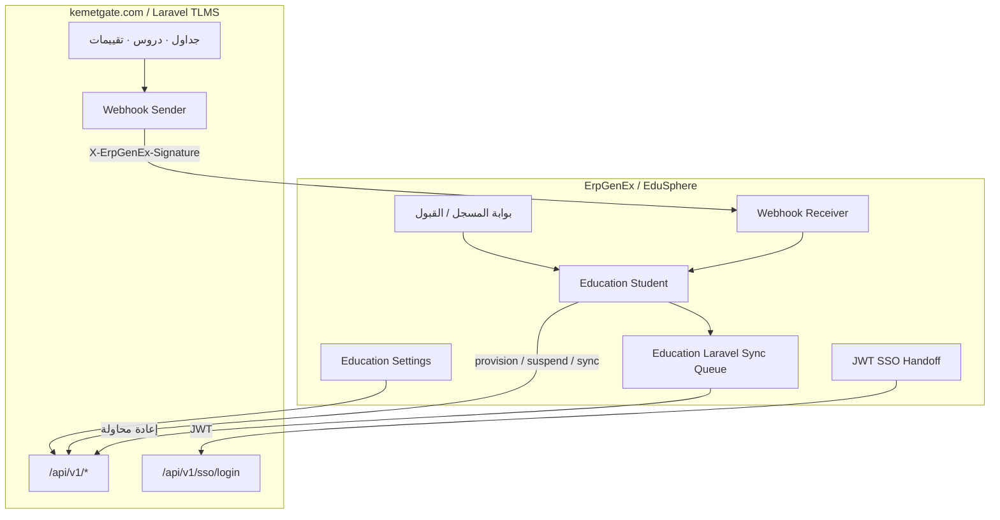
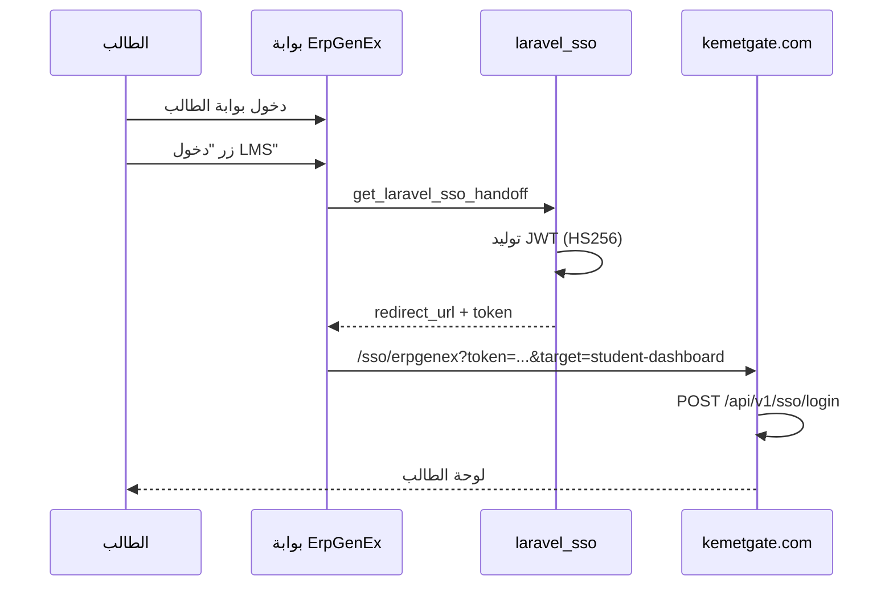

# EduSphere ↔ kemetgate.com — دليل الربط المتكامل

> **الإصدار:** 1.0  
> **التاريخ:** 2026-06-23  
> **التطبيق:** `omnexa_education` (EduSphere)  
> **المنصة التعليمية:** [kemetgate.com](https://kemetgate.com/) — Laravel Eschools / EduAi  
> **بوابة الربط في ErpGenEx:** `/app/education-laravel-integration`  
> **الإعدادات:** Education Settings → Laravel TLMS Integration

---

## فهرس المحتويات

1. [نظرة عامة](#1-نظرة-عامة)
2. [تقسيم المسؤوليات](#2-تقسيم-المسؤوليات)
3. [الأسرار والمتغيرات المشتركة](#3-الأسرار-والمتغيرات-المشتركة)
4. [الاتجاه الأول: ErpGenEx → Laravel](#4-الاتجاه-الأول-erpgenex--laravel)
5. [الاتجاه الثاني: Laravel → ErpGenEx](#5-الاتجاه-الثاني-laravel--erpgenex)
6. [الاتجاه الثالث: SSO (دخول موحّد)](#6-الاتجاه-الثالث-sso-دخول-موحّد)
7. [دورة حياة الطالب والمزامنة](#7-دورة-حياة-الطالب-والمزامنة)
8. [واجهات API الكاملة](#8-واجهات-api-الكاملة)
9. [أمثلة JSON](#9-أمثلة-json)
10. [قائمة التحقق (Checklist)](#10-قائمة-التحقق-checklist)
11. [أوامر Bench](#11-أوامر-bench)
12. [استكشاف الأخطاء](#12-استكشاف-الأخطاء)
13. [ملاحظات النشر والبنية](#13-ملاحظات-النشر-والبنية)
14. [مراجع](#14-مراجع)

---

## 1. نظرة عامة

EduSphere (ErpGenEx) هو **نظام معلومات الطلاب (SIS)** — القبول، التسجيل، الرسوم، حسابات المستخدمين، والحجز المالي.

[kemetgate.com](https://kemetgate.com/) هو **نظام التعليم والتعلّم (TLMS)** — الجداول، الحصص، الدروس، التقييمات، وبوابات المعلّم والطالب.

### مبدأ التصميم

> **ErpGenEx يتحكم في دورة حياة الحساب.**  
> Laravel **لا ينشئ طلاباً** من واجهته — يستقبل أوامر الإنشاء والإيقاف والمزامنة من ErpGenEx فقط.

### مخطط الربط من الاتجاهين



### جدول الاتجاهات

| # | الاتجاه | الآلية | الغرض |
|---|---------|--------|--------|
| 1 | ErpGenEx → Laravel | REST API + Bearer Token | حسابات، مزامنة، إيقاف/استئناف |
| 2 | Laravel → ErpGenEx | Webhooks موقّعة HMAC | درجات، جداول، حضور، دروس |
| 3 | ErpGenEx → Laravel | JWT SSO | دخول الطالب/ولي الأمر من بوابة ErpGenEx |

---

## 2. تقسيم المسؤوليات

| المحور | ErpGenEx (مصدر التحكم) | Laravel kemetgate (تنفيذ تعليمي) |
|--------|------------------------|-----------------------------------|
| إنشاء/إيقاف حساب طالب | ✅ الإدارة | يُنشأ/يُوقف فقط عبر API |
| القبول والتسجيل الأكاديمي | ✅ | يستقبل البيانات |
| الرسوم والحجز المالي | ✅ | يُطبَّق suspend/resume |
| الفصول والمقررات والبرامج | ✅ | `programs/sync`, `classes/sync`, `enrollments/sync` |
| الجداول والحصص والدروس | يستقبل webhook | ✅ الإنشاء والتشغيل |
| الدرجات والتقييمات | يستقبل webhook | ✅ النشر عبر `grade.posted` |
| إنشاء طالب من واجهة Laravel | ❌ ممنوع بالتصميم | — |

### بوابات الإدارة في ErpGenEx

| البوابة | المسار | الدور |
|---------|--------|-------|
| مركز العمل التعليمي | `/app/education-workcenter` | نقطة انطلاق |
| القبول | `/app/education-admissions-portal` | تسجيل الطلبات |
| المسجل | `/app/education-registrar-desk` | قبول وإنشاء الطلاب |
| ربط Laravel | `/app/education-laravel-integration` | إعدادات واختبار الربط |
| بوابة الطالب | `/app/education-student-portal` | SSO إلى kemetgate |
| بوابة ولي الأمر | `/app/education-parent-mobile` | SSO إلى kemetgate |

---

## 3. الأسرار والمتغيرات المشتركة

يجب أن تكون **نفس القيم** في النظامين.

| المتغير | ErpGenEx — Education Settings | Laravel — `.env` على kemetgate |
|---------|------------------------------|--------------------------------|
| مفتاح API | `laravel_api_key` | `ERPGENEX_API_KEY` |
| سر Webhook | `laravel_webhook_secret` | `ERPGENEX_WEBHOOK_SECRET` |
| سر JWT (SSO) | `laravel_jwt_secret` | `JWT_SECRET` / `ERPGENEX_JWT_SECRET` |
| عنوان ErpGenEx العام | — (يُولَّد من `get_url()`) | `ERPGENEX_BASE_URL` |
| عنوان Laravel | `laravel_base_url` | — |
| رأس المؤسسة | `laravel_institution_header` | `ERPGENEX_TENANT_HEADER` |
| تفعيل الربط | `enable_laravel_tlms` | `ERPGENEX_ENABLED=true` |

### قيم تجريبية (بيئة Demo)

```
Laravel Base URL:  https://kemetgate.com
API Key:           edusphere-demo-api-key-2026
Webhook Secret:    edusphere-webhook-secret-2026
JWT Secret:        edusphere-jwt-shared-secret-2026
Tenant Header:     X-ErpGenEx-School
```

### ملف تكامل Laravel (يُولَّد تلقائياً)

عند تشغيل bootstrap يُنشأ:

```
frappe-bench/LMS/Eschools/.env.erpgenex.integration
```

**مهم:** لا ترفع `LMS/Eschools` من bench — kemetgate منشور مسبقاً. انسخ القيم من هذا الملف إلى `.env` على سيرفر kemetgate.

---

## 4. الاتجاه الأول: ErpGenEx → Laravel

### 4.1 إعداد ErpGenEx

#### من الواجهة

1. افتح **Education Settings**
2. فعّل **Enable Laravel TLMS**
3. املأ:
   - **Laravel Base URL:** `https://kemetgate.com`
   - **Laravel API Key**
   - **Laravel Webhook Secret**
   - **Laravel JWT Secret**
4. فعّل (موصى به):
   - `auto_provision_student_user` — إنشاء حساب تلقائي عند القبول
   - `auto_provision_parent_user` — حساب ولي الأمر
   - `auto_sync_enrollments_on_submit` — مزامنة عند اعتماد تسجيل المقرر
   - `laravel_sso_enabled` — الدخول الموحّد
   - `auto_suspend_on_overdue` — إيقاف عند تأخر الرسوم (اختياري)
5. اضغط **Test Laravel Connection**

#### من سطر الأوامر (bootstrap)

```bash
bench --site {site} execute \
  omnexa_education.api.education_laravel_bootstrap.connect_kemetgate_laravel
```

يقوم بـ:
- ضبط Education Settings
- كتابة `.env.erpgenex.integration`
- مزامنة المؤسسات (إن كان API متاحاً)
- اختبار Ping
- التحقق من البوابات

**معاملات اختيارية:**

```bash
# بدون مزامنة كاملة — إعداد فقط
bench --site {site} execute \
  omnexa_education.api.education_laravel_bootstrap.connect_kemetgate_laravel \
  --kwargs '{"full_sync":0,"provision_accounts":0}'
```

---

### 4.2 إعداد kemetgate (Laravel)

على سيرفر [kemetgate.com](https://kemetgate.com/) دمج في `.env`:

```env
ERPGENEX_ENABLED=true
ERPGENEX_BASE_URL=https://YOUR-PUBLIC-ERP-URL
ERPGENEX_WEBHOOK_URL=${ERPGENEX_BASE_URL}/api/method/omnexa_education.api.laravel_webhooks.receive
ERPGENEX_WEBHOOK_SECRET=edusphere-webhook-secret-2026
ERPGENEX_API_KEY=edusphere-demo-api-key-2026
ERPGENEX_TENANT_HEADER=X-ErpGenEx-School
JWT_SECRET=edusphere-jwt-shared-secret-2026
ERPGENEX_JWT_SECRET=edusphere-jwt-shared-secret-2026
ALLOW_READONLY_ON_HOLD=false
```

ثم:

```bash
git pull origin main
php artisan migrate --force
php artisan config:cache
php artisan route:cache
```

> **`ERPGENEX_BASE_URL` يجب أن يكون عنوان ErpGenEx عاماً** (HTTPS، ليس `localhost`) حتى تصل Webhooks من kemetgate إلى ErpGenEx.

---

### 4.3 اختبار الاتصال

```bash
# من ErpGenEx
bench --site {site} execute omnexa_education.api.laravel_client.ping

# مباشرة
curl -s https://kemetgate.com/api/v1/health
```

**الرد المتوقع:**

```json
{"status":"ok","message":"pong","version":"1.0","service":"edusphere-tlms"}
```

---

### 4.4 ترتيب المزامنة (مهم)

| # | الخطوة | API | Header المؤسسة |
|---|--------|-----|-----------------|
| 1 | تسجيل المدارس/الجامعات | `POST /api/v1/institutions/sync` | **بدون** `X-ErpGenEx-School` |
| 2 | البرامج والمقررات | `POST /api/v1/programs/sync` | **مع** `X-ErpGenEx-School` |
| 3 | الفصول | `POST /api/v1/classes/sync` | مع |
| 4 | التقويم الأكاديمي | `POST /api/v1/academic-calendar/sync` | مع |
| 5 | حسابات الطلاب | `POST /api/v1/users/provision` | مع |
| 6 | تسجيل المقررات | `POST /api/v1/enrollments/sync` | مع |

**Headers على الطلبات (ما عدا institutions/sync):**

```http
Authorization: Bearer {laravel_api_key}
X-ErpGenEx-School: {Education Institution name}
Content-Type: application/json
Accept: application/json
```

---

### 4.5 ربط المقررات

1. أنشئ **Education Lms Course Link**
2. Provider: **Laravel TLMS**
3. **External Course ID** = معرّف المقرر في kemetgate

---

### 4.6 طابور إعادة المحاولة

عند فشل أي مزامنة، يُضاف الطلب إلى **Education Laravel Sync Queue**.

المعالج التلقائي: Scheduler كل ساعة.

يدوياً:

```bash
bench --site {site} execute omnexa_education.api.laravel_client.process_sync_queue
```

**عمليات الطابور المدعومة:**

`provision` · `suspend` · `resume` · `sync_enrollment` · `sync_classes` · `sync_programs` · `sync_academic_calendar` · `sync_institutions` · `webhook_replay`

---

## 5. الاتجاه الثاني: Laravel → ErpGenEx

### 5.1 عنوان Webhook

```
POST {ERPGENEX_BASE_URL}/api/method/omnexa_education.api.laravel_webhooks.receive
```

يُعرض أيضاً في Education Settings / بوابة Laravel Integration بعد الحفظ.

### 5.2 التوقيع الأمني

Laravel يوقّع الجسم الخام (raw body):

```http
X-ErpGenEx-Signature: sha256=<HMAC-SHA256(raw_body, webhook_secret)>
```

ErpGenEx يتحقق في `omnexa_education.api.laravel_webhooks.receive`.

توقيع خاطئ → **401 Authentication Error**.

### 5.3 الأحداث المدعومة

| الحدث | النتيجة في ErpGenEx |
|-------|---------------------|
| `grade.posted` | سجل في **Education Assessment Result** |
| `timetable.approved` | صفوف في **Education Timetable Entry** |
| `attendance.recorded` | تسجيل حضور |
| `lesson.completed` | تسجيل درس مكتمل |
| أحداث أخرى | `{"ok": true, "ignored": true}` |

### 5.4 اختبار Webhook

```bash
SECRET="edusphere-webhook-secret-2026"
BODY='{"event":"grade.posted","timestamp":"2026-06-23T12:00:00Z","school_id":"MH-EDU-DEMO-UNIV","data":{"student_external_id":"TEST-STU","course_external_id":"MATH-G11","score":85,"max_score":100}}'
SIG=$(echo -n "$BODY" | openssl dgst -sha256 -hmac "$SECRET" | awk '{print "sha256="$2}')

curl -X POST "https://YOUR-PUBLIC-ERP-URL/api/method/omnexa_education.api.laravel_webhooks.receive" \
  -H "Content-Type: application/json" \
  -H "X-ErpGenEx-Signature: $SIG" \
  -d "$BODY"
```

---

## 6. الاتجاه الثالث: SSO (دخول موحّد)

### 6.1 الإعداد

| ErpGenEx | Laravel |
|----------|---------|
| `laravel_sso_enabled = 1` | `JWT_SECRET` مطابق |
| `laravel_jwt_secret` | يتحقق في `POST /api/v1/sso/login` |

### 6.2 التدفق



### 6.3 شروط SSO

- `laravel_user_id` موجود على **Education Student**
- `account_access_status = Active`
- لا `financial_hold`
- المستخدم ليس Guest أو Administrator

### 6.4 API الداخلي

```
omnexa_education.api.laravel_sso.get_laravel_sso_handoff
```

يُستدعى من:
- `/app/education-student-portal`
- `/app/education-parent-mobile`

---

## 7. دورة حياة الطالب والمزامنة

### 7.1 حالات الحساب

```
Not Provisioned → Provisioning → Active
                                    ↕ Financial Hold / Suspended
                                    → Withdrawn (انسحاب / تخرج)
```

**الحقول في Education Student:**

| الحقل | الغرض |
|-------|--------|
| `user` | حساب Frappe |
| `laravel_user_id` | معرّف المستخدم في kemetgate |
| `account_access_status` | حالة الوصول |
| `financial_hold` | حجز مالي |
| `last_laravel_sync_at` | آخر مزامنة |

### 7.2 إنشاء طالب من الإدارة

```
القبول → Education Student (حفظ) → auto_provision (إن مفعّل) → provision_student
```

**ما يفعله `provision_student`:**

1. إنشاء **Frappe User** + دور `Education Student Portal`
2. `POST /api/v1/users/provision` إلى kemetgate
3. حفظ `laravel_user_id` و `account_access_status = Active`
4. تسجيل في **Education Account Access Log**

**يدوياً:** نموذج Education Student → زر **Provision Portal Account**

### 7.3 المزامنة التلقائية

| الحدث في ErpGenEx | الإجراء | API Laravel |
|-------------------|---------|-------------|
| `after_insert` طالب نشط | `auto_provision_if_needed` | `users/provision` |
| `Education Course Enrollment` Submit | `sync_single_course_enrollment` | `enrollments/sync` |
| `Education Section` تحديث | `sync_institution_classes_to_laravel` | `classes/sync` |
| `Education Program` تحديث | `sync_institution_programs_to_laravel` | `programs/sync` |
| فاتورة متأخرة | `apply_financial_hold` | `users/{id}/suspend` |
| Payment Entry (سداد) | `release_financial_hold` | `users/{id}/resume` |
| انسحاب / تخرج | `deprovision_student` | تعطيل User |

### 7.4 التحكم الإداري من نموذج الطالب

| الزر | ErpGenEx | kemetgate |
|------|----------|-----------|
| Provision Portal Account | User + Active | `users/provision` |
| Suspend Access | تعطيل User | `users/{id}/suspend` |
| Resume Access | تفعيل User | `users/{id}/resume` |
| Sync Laravel Enrollments | — | `enrollments/sync` |

**الأدوار المسموحة:** Education Manager · Accounts User · System Manager

### 7.5 ملاحظة: تحديث بيانات الطالب

تعديل **الفصل / البرنامج / المستوى** بعد الإنشاء **لا يُزامَن تلقائياً** إلى Laravel.

الحلول:
- زر **Sync Laravel Enrollments** في نموذج الطالب
- إعادة **Provision** يدوياً
- اعتماد **Education Course Enrollment** جديد

---

## 8. واجهات API الكاملة

### 8.1 ErpGenEx → Laravel (`https://kemetgate.com/api/v1`)

| Method | Path | الغرض | Tenant Header |
|--------|------|--------|---------------|
| GET | `/health` | اختبار الاتصال | لا |
| POST | `/sso/login` | SSO | لا |
| POST | `/institutions/sync` | تسجيل مؤسسات | لا |
| POST | `/users/provision` | إنشاء/تحديث مستخدم | نعم |
| POST | `/users/{id}/suspend` | إيقاف | نعم |
| POST | `/users/{id}/resume` | استئناف | نعم |
| DELETE | `/users/{id}` | حذف | نعم |
| POST | `/programs/sync` | برامج ومقررات | نعم |
| POST | `/classes/sync` | فصول | نعم |
| POST | `/enrollments/sync` | تسجيل طلاب | نعم |
| POST | `/academic-calendar/sync` | تقويم | نعم |
| GET | `/integration/status` | حالة الربط | نعم |

### 8.2 واجهات Frappe (ErpGenEx)

| الوظيفة | Method |
|---------|--------|
| اختبار Ping | `omnexa_education.api.laravel_client.ping` |
| Bootstrap كامل | `omnexa_education.api.education_laravel_bootstrap.connect_kemetgate_laravel` |
| تفعيل طالب | `omnexa_education.api.student_account_lifecycle.provision_student` |
| إيقاف | `omnexa_education.api.student_account_lifecycle.suspend_student` |
| استئناف | `omnexa_education.api.student_account_lifecycle.resume_student` |
| إيقاف المتأخرين | `omnexa_education.api.student_account_lifecycle.bulk_suspend_overdue` |
| مزامنة تسجيل LMS | `omnexa_education.api.education_lms.sync_lms_enrollment` |
| مزامنة كل تسجيلات طالب | `omnexa_education.api.education_lms.sync_all_laravel_enrollments` |
| مزامنة مؤسسة كاملة | `omnexa_education.api.laravel_sync.sync_institution_full_to_laravel` |
| معالجة الطابور | `omnexa_education.api.laravel_client.process_sync_queue` |
| SSO | `omnexa_education.api.laravel_sso.get_laravel_sso_handoff` |
| Webhook وارد | `omnexa_education.api.laravel_webhooks.receive` |

### 8.3 Laravel → ErpGenEx (Webhook)

```
POST /api/method/omnexa_education.api.laravel_webhooks.receive
Header: X-ErpGenEx-Signature: sha256=...
```

---

## 9. أمثلة JSON

### 9.1 Provision طالب (ErpGenEx → Laravel)

```json
{
  "external_id": "COMPANY-STU001",
  "student_external_id": "COMPANY-STU001",
  "student_code": "STU001",
  "email": "stu001@school.local",
  "first_name": "أحمد",
  "last_name": "حسن",
  "role": "student",
  "institution_id": "MH-EDU-DEMO-UNIV",
  "institution_type": "University",
  "program_id": "PROG-CS",
  "grade_level": "Year 2",
  "section": "SEC-A",
  "account_status": "active",
  "academic_model": "university",
  "enrollments": [
    {
      "student_external_id": "COMPANY-STU001",
      "course_external_id": "CS101",
      "section_external_id": "SEC-A",
      "role": "student"
    }
  ]
}
```

**الرد المتوقع:**

```json
{
  "id": "uuid-or-int",
  "laravel_user_id": "uuid-or-int",
  "external_id": "COMPANY-STU001",
  "account_status": "active"
}
```

### 9.2 تسجيل مؤسسة (ErpGenEx → Laravel)

```json
{
  "institutions": [
    {
      "external_id": "MH-EDU-DEMO-UNIV",
      "name": "ErpGenEx University",
      "code": "DEMO-UNIV",
      "institution_type": "University"
    }
  ]
}
```

### 9.3 Webhook درجة (Laravel → ErpGenEx)

```json
{
  "event": "grade.posted",
  "timestamp": "2026-06-23T12:00:00Z",
  "school_id": "MH-EDU-DEMO-UNIV",
  "data": {
    "student_external_id": "COMPANY-STU001",
    "course_external_id": "CS101",
    "assessment_external_id": "EXAM-MID-2026",
    "score": 87,
    "max_score": 100,
    "term": "2025-2026-T2"
  }
}
```

---

## 10. قائمة التحقق (Checklist)

### المرحلة أ — الإعداد الأولي

- [ ] Education Settings: `enable_laravel_tlms` + `https://kemetgate.com`
- [ ] الأسرار الثلاثة متطابقة في النظامين
- [ ] Ping يرجع `pong`
- [ ] kemetgate: `php artisan route:cache` بعد التحديث

### المرحلة ب — ErpGenEx → Laravel

- [ ] `POST /institutions/sync` يعمل (ليس 404)
- [ ] `POST /programs/sync` ناجح
- [ ] `POST /classes/sync` ناجح
- [ ] طالب تجريبي → Provision → `laravel_user_id` ممتلئ
- [ ] Course Enrollment Submit → `enrollments/sync` ناجح
- [ ] فاتورة متأخرة → suspend في kemetgate
- [ ] سداد → resume في kemetgate

### المرحلة ج — Laravel → ErpGenEx

- [ ] `ERPGENEX_BASE_URL` عام ومتاح من kemetgate
- [ ] `grade.posted` يُسجَّل في ErpGenEx
- [ ] `timetable.approved` يُسجَّل
- [ ] توقيع خاطئ → مرفوض

### المرحلة د — SSO

- [ ] JWT secrets متطابقة
- [ ] زر LMS من بوابة الطالب يفتح kemetgate
- [ ] financial hold يمنع SSO

### المرحلة هـ — سيناريوهات القبول

| # | السيناريو | معيار النجاح |
|---|-----------|--------------|
| 1 | تفعيل طالب من ErpGenEx | User في Frappe + مستخدم في kemetgate خلال 30 ث |
| 2 | فاتورة متأخرة | financial_hold + User معطّل + suspend |
| 3 | Payment Entry | رفع الحجز + resume |
| 4 | Webhook grade.posted | صف Assessment Result |
| 5 | Webhook timetable.approved | صفوف Timetable Entry |
| 6 | توقيع Webhook خاطئ | رفض 401 |
| 7 | بوابة الطالب | منع عند financial hold |

---

## 11. أوامر Bench

```bash
SITE=erpgenex.local.site

# ربط kemetgate (إعداد + مزامنة)
bench --site $SITE execute \
  omnexa_education.api.education_laravel_bootstrap.connect_kemetgate_laravel

# إعداد فقط بدون مزامنة كاملة
bench --site $SITE execute \
  omnexa_education.api.education_laravel_bootstrap.connect_kemetgate_laravel \
  --kwargs '{"full_sync":0,"provision_accounts":0}'

# Ping
bench --site $SITE execute omnexa_education.api.laravel_client.ping

# تفعيل طالب
bench --site $SITE execute \
  omnexa_education.api.student_account_lifecycle.provision_student \
  --kwargs '{"student":"MH-EDU-DEMO-UNIV-STU001","trigger":"Manual"}'

# مزامنة مؤسسة كاملة
bench --site $SITE execute \
  omnexa_education.api.laravel_sync.sync_institution_full_to_laravel \
  --kwargs '{"institution":"MH-EDU-DEMO-UNIV"}'

# طابور المزامنة
bench --site $SITE execute \
  omnexa_education.api.laravel_client.process_sync_queue

# إيقاف المتأخرين مالياً
bench --site $SITE execute \
  omnexa_education.api.student_account_lifecycle.bulk_suspend_overdue

# التحقق من البوابات
bench --site $SITE execute \
  omnexa_education.api.portal_validation.validate_all_portals
```

---

## 12. استكشاف الأخطاء

| الخطأ | السبب المحتمل | الحل |
|-------|---------------|------|
| Ping فاشل | URL أو API Key خاطئ | راجع Education Settings |
| `404 institutions/sync` | API غير منشور على kemetgate | `git pull` + `route:cache` على kemetgate |
| `422 Unknown institution` | المؤسسة غير مسجّلة | نفّذ `institutions/sync` أولاً |
| `laravel_user_id` فارغ | Provision فشل | راجع Error Log + الطابور |
| Webhook لا يصل | `ERPGENEX_BASE_URL` محلي | استخدم عنوان ERP عام |
| Webhook 401 | سر التوقيع مختلف | طابق `webhook_secret` |
| SSO مرفوض | لا `laravel_user_id` | Provision الطالب أولاً |
| SSO مرفوض | financial hold | سداد الرسوم |
| `NameError is_laravel_enabled` | إصدار قديم | حدّث `omnexa_education` من GitHub |
| بناء تطبيق فاشل `paths[0] undefined` | esbuild قبل إدراج التطبيق في apps.txt | patch `frappe/esbuild/utils.js` (انظر §13) |

---

## 13. ملاحظات النشر والبنية

### 13.1 LMS/Eschools — لا يُرفع من Bench

منصة kemetgate منشورة على السيرفر الخارجي. التحديثات على Laravel تتم **مباشرة على kemetgate** (`git pull`)، وليس عبر `bench get-app`.

### 13.2 إصلاح بناء Frappe (esbuild)

عند `bench get-app` قد يفشل البناء بـ:

```
TypeError: paths[0] must be string, Received undefined
```

**السبب:** `get_public_path(app)` يُرجع `undefined` إذا التطبيق غير موجود في `sites/apps.txt` عند تحميل esbuild.

**الإصلاح** في `apps/frappe/esbuild/utils.js`:

```javascript
const get_public_path = (app) => {
	if (public_paths[app]) {
		return public_paths[app];
	}
	return path.resolve(apps_path, app, app, "public");
};
```

نسخة patch: `frappe-bench/backups/frappe-esbuild-get-public-path.patch`

### 13.3 DocTypes ذات الصلة

| DocType | الغرض |
|---------|-------|
| Education Settings | إعدادات الربط |
| Education Student | الطالب + laravel_user_id |
| Education Institution | المؤسسة (sis_external_id) |
| Education Lms Course Link | ربط مقرر ErpGenEx ↔ Laravel |
| Education Laravel Sync Queue | طابور إعادة المحاولة |
| Education Account Access Log | سجل تدقيق الحسابات |
| Education Course Enrollment | تسجيل مقرر → مزامنة تلقائية |

### 13.4 الحالة الحالية (2026-06-23)

| الاختبار | الحالة |
|---------|--------|
| kemetgate.com يعمل | ✅ |
| Health API / Ping | ✅ |
| omnexa_education على GitHub | ✅ (`11ede59+`) |
| EduSphere portals | ✅ 100% |
| `institutions/sync` على kemetgate | ❌ يحتاج نشر |
| مزامنة طلاب/مقررات كاملة | ❌ بعد تسجيل المؤسسات |
| Webhooks حية | ❌ يحتاج ERP URL عام |
| SSO | ⏳ بعد Provision الطلاب |

---

## 14. مراجع

| المستند | المسار |
|---------|--------|
| دليل ربط Laravel (عربي) | `docs/LARAVEL_TLMS_INTEGRATION_GUIDE_AR.md` |
| مواصفات Laravel للمطورين (إنجليزي) | `docs/LARAVEL_TLMS_INTEGRATION_PROMPT.md` |
| خطة ISMS | `docs/ISMS_MASTER_PLAN_AR.md` |
| دليل Laravel Eschools | `LMS/Eschools/Docs/docs/ERPGENEX_INTEGRATION_GUIDE_AR.md` |
| OpenAPI | `LMS/Eschools/Docs/docs/erpgenex-tlms-openapi.yaml` |
| تشيكليست الربط | `Docs/2026-06-23/LARAVEL_SIS_INTEGRATION_CHECKLIST_AR.md` |

---

*EduSphere · kemetgate.com · دليل الربط المتكامل من الاتجاهين · v1.0 · ErpGenEx 2026*
