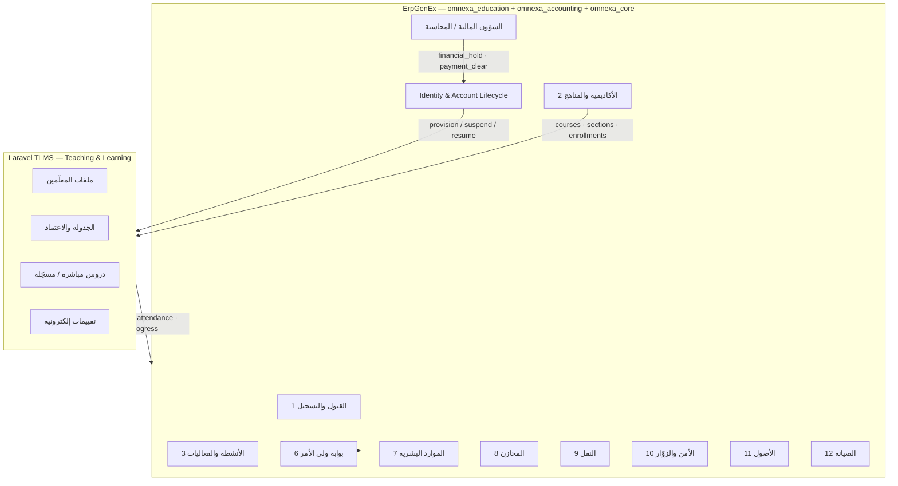

# خطة تطوير ISMS — omnexa_education + Laravel TLMS

**المرجع:** `Docs/NewEducationIN/ISMS_Specification_AR.docx` v1.0  
**التطبيق:** `omnexa_education` (ErpGenEx — Education)  
**الهدف:** منصّة ISMS موحّدة تنافس Workday Student · Ellucian Banner · PowerSchool وتتفوّق عليها (≥ 4.90/5.00)

---

## 1. الرؤية المعمارية (Split Architecture)

المواصفات ISMS تغطّي 12 وحدة. **الوحدة 5 (إدارة التدريس والتعلّم)** تُنفَّذ على **Laravel خارجي**؛ باقي الوحدات على **ErpGenEx (Frappe)**.



### مبدأ «مصدر الحقيقة» (Source of Truth)

| البيان | المصدر | المستهلك |
|--------|--------|----------|
| هوية الطالب، ولي الأمر، المعلّم | ErpGenEx `User` + `Education Student` | Laravel |
| حالة الحساب (نشط / موقوف / مالي) | ErpGenEx — **الإدارة المالية** | Laravel + Frappe |
| الهيكل الأكاديمي (مرحلة، صف، شعبة، مادة) | ErpGenEx | Laravel |
| الرسوم، الفواتير، التحصيل | ErpGenEx + ERP | بوابة ولي الأمر |
| الجدول المعتمد، الدروس، الاختبارات | Laravel | ErpGenEx (مزامنة) |
| الدرجات النهائية المعتمدة | ErpGenEx (بعد اعتماد) | Laravel (قراءة) |

---

## 2. ربط §5 — إدارة التدريس والتعلّم (Laravel)

### 2.1 نطاق Laravel (خارج ErpGenEx)

وفق ISMS §5:

- ملف توثيقي لكل معلّم (مقرّرات، مناهج، إسنادات)
- إسناد المقرّرات والمناهج
- مسوّدة جدول → مراجعة → اعتماد إدارة المدرسة
- منسّق جداول
- دروس مسجّلة / مباشرة (Zoom/Teams/BBB أو WebRTC)
- تقييمات إلكترونية

### 2.2 ما يبقى في ErpGenEx

- `Education Teacher` · `Education Course` · `Education Section` · `Education Subject`
- `Education Timetable` (مسوّدة قبل الإرسال لـ Laravel)
- `Education Lms Course Link` — provider = **`Laravel TLMS`**
- API: `education_lms.py` → client Laravel
- Webhooks واردة من Laravel للدرجات والحضور

### 2.3 بروتوكول التكامل

| الطبقة | المعيار | الاستخدام |
|--------|---------|-----------|
| REST API | OpenAPI 3.1 | CRUD users, enrollments, timetables |
| Webhooks | HMAC-SHA256 | events: grade.posted, lesson.completed |
| SSO | OAuth2 + OIDC | دخول موحّد Student/Teacher/Parent |
| Rostering | **OneRoster 1.2** | مزامنة orgs, users, classes, enrollments |
| Launch | **LTI 1.3** (اختياري) | تشغيل دروس من بوابة ErpGenEx |
| Analytics | **xAPI / Caliper** | تتبّع التفاعل التعليمي |
| Compliance | FERPA · GDPR · ISO 27001 | سجلات تدقيق |

---

## 3. التحكم المالي في حسابات الدخول (المتطلب الأساسي)

**القاعدة:** لا يُنشَأ حساب Laravel للطالب إلا بعد **تسجيل مؤكّد + سياسة مالية**. الإيقاف/التشغيل من **الشؤون المالية** وليس من Laravel.

### 3.1 حالات الحساب

```
provisioning → active → financial_hold → suspended → withdrawn
                    ↑__________________________|
                         (after payment)
```

| الحالة | Frappe User | Laravel User | الوصول للدروس |
|--------|-------------|--------------|----------------|
| `provisioning` | enabled=0 | غير موجود | لا |
| `active` | enabled=1 | active | نعم |
| `financial_hold` | enabled=0 | suspended | لا (قراءة فقط اختياري) |
| `suspended` | enabled=0 | suspended | لا |
| `withdrawn` | enabled=0 | archived | لا |

### 3.2 محفّزات تلقائية (Triggers)

| الحدث في ErpGenEx | الإجراء |
|-------------------|---------|
| تأكيد تسجيل طالب + دفع/اعتماد مالي | `provision_student_accounts()` |
| `Sales Invoice` متأخرة > grace (Late Fee Rule) | `apply_financial_hold()` |
| تسوية كامل المستحقات | `release_financial_hold()` |
| يدوي من Accounts User / Education Manager | `suspend` / `resume` |
| `Education Student.status` = Withdrawn | `deprovision()` |

### 3.3 DocTypes / حقول جديدة (مرحلة 1)

**Education Settings** — تبويب Laravel Integration:
- `laravel_base_url`, `laravel_api_key` (Password), `laravel_webhook_secret`
- `auto_suspend_on_overdue`, `grace_days_override`
- `enable_laravel_sso`

**Education Student** — تبويب Digital Access:
- `user` (Link → User)
- `laravel_user_id`, `account_access_status`
- `financial_hold`, `financial_hold_reason`, `last_sync_at`

**Education Account Access Log** (Child / DocType):
- `action`, `trigger`, `performed_by`, `laravel_response`, `timestamp`

**Education Laravel Sync Queue** — Job queue للمزامنة مع retry

---

## 4. خريطة الوحدات الـ12 — ISMS → ErpGenEx

| # | وحدة ISMS | التطبيق | الحالة الحالية | الأولوية |
|---|-----------|---------|----------------|----------|
| 1 | القبول والتسجيل | omnexa_education | DocTypes + API جزئي | P0 |
| 2 | الأكاديمية والمناهج | omnexa_education | scaffold قوي | P0 |
| 3 | الأنشطة والفعاليات | omnexa_education | جزئي | P1 |
| 4 | **التدريس والتعلّم** | **Laravel** | غير مربوط | **P0** |
| 5 | بوابة ولي الأمر | omnexa_education + PWA | صفحات stub | P0 |
| 6 | الموارد البشرية | omnexa_hr / ERPNext HR | تكامل | P1 |
| 7 | المخازن | omnexa_inventory / ERPNext | تكامل | P2 |
| 8 | النقل | omnexa_education (مستقبلي) | غير موجود | P2 |
| 9 | الأمن والزوّار | omnexa_education (مستقبلي) | غير موجود | P2 |
| 10 | الأصول | omnexa_assets / ERPNext | تكامل | P2 |
| 11 | الصيانة | omnexa_maintenance | تكامل | P2 |
| 12 | البنية السحابية | omnexa_core + bench | موجود | P0 |

---

## 5. مراحل التنفيذ (Roadmap)

### المرحلة 0 — الأساس (أسبوع 1–2)
- [ ] حقول Laravel في `Education Settings`
- [ ] `Education Student.user` + أدوار Student / Parent / Teacher
- [ ] `api/laravel_client.py` + `api/student_account_lifecycle.py`
- [ ] Webhook endpoint `/api/method/omnexa_education.api.laravel_webhooks.receive`
- [ ] Unit tests للـ lifecycle

### المرحلة 1 — M1 Integration (أسبوع 3–4)
- [ ] OneRoster export/import (orgs, users, classes)
- [ ] Enrollment sync عند التسجيل
- [ ] Financial hold ↔ Laravel suspend
- [ ] Dashboard: Account Access Control (Finance desk)

### المرحلة 2 — TLMS Core (أسبوع 5–8) — **فريق Laravel**
- [ ] Teacher dossier · Timetable draft/approve workflow
- [ ] Live + recorded lessons
- [ ] E-assessments → webhook grades إلى ErpGenEx

### المرحلة 3 — ISMS Modules P1 (أسبوع 9–12)
- [ ] §2 اختيار مواد ثانوية + اعتماد ولي الأمر + حساب رسوم
- [ ] §3 تقويم أنشطة + اشتراكات مدفوعة
- [ ] §6 بوابة ولي الأمر (PWA) — حضور، درجات، شكاوى

### المرحلة 4 — Global Leader Gate (أسبوع 13–16)
- [ ] FERPA audit trail (موجود جزئياً)
- [ ] OneRoster + LTI certification readiness
- [ ] Benchmark score ≥ 4.90 (`education_global_benchmark.py`)
- [ ] Load test 10K students / multi-campus

---

## 6. معايير التقييم العالمي (Target #1)

| المعيار | المرجع | هدف omnexa |
|---------|--------|------------|
| SIS completeness | Banner · PowerSchool · Workday | ≥ 98% feature parity |
| Interoperability | IMS Global (OneRoster, LTI, CASE) | Certified-ready |
| Privacy | FERPA · GDPR · COPPA | Full audit + consent |
| Security | ISO 27001 · SOC 2 patterns | RBAC + encryption + logs |
| Accessibility | WCAG 2.2 AA | Portals + LMS |
| API | OpenAPI + rate limits | Public docs |
| Uptime | 99.9% SLA | Cloud-native |

**KPI رئيسي:** `weighted_score ≥ 4.90` في `get_global_sis_score()` مع `gaps_open = 0` حقيقي (ليس placeholder).

---

## 7. ملفات التطوير الرئيسية

```
apps/omnexa_education/
  omnexa_education/api/
    education_lms.py              ← توسيع Laravel sync
    laravel_client.py             ← جديد
    student_account_lifecycle.py  ← جديد
    laravel_webhooks.py           ← جديد
  omnexa_education/billing.py     ← hook financial_hold
  omnexa_education/hooks.py       ← schedulers + doc_events
  doctype/education_settings/     ← Laravel fields
  doctype/education_student/      ← user + access status
  docs/
    ISMS_MASTER_PLAN_AR.md          ← هذا الملف
    LARAVEL_TLMS_INTEGRATION_PROMPT.md
    ISMS_GLOBAL_DEVELOPMENT_CHECKLIST.md
```

---

## 8. الأدوار والصلاحيات (ISMS §14)

| الدور ISMS | دور ErpGenEx | صلاحية إيقاف حساب |
|------------|--------------|-------------------|
| الشؤون المالية | Accounts User · Education Manager | ✅ كامل |
| إدارة المدرسة | Education Manager | ✅ (بدون تجاوز مالي) |
| المعلّم | Teacher | ❌ |
| ولي الأمر | Parent Portal User | ❌ |
| الطالب | Student Portal User | ❌ |

---

*ErpGenEx — Omnexa Education · ISMS Master Plan · v1.0*
