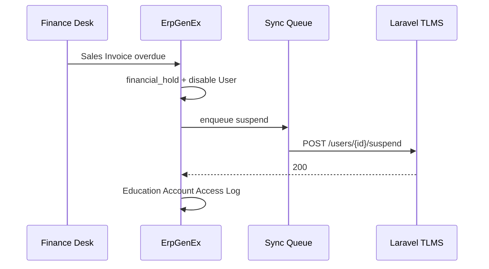
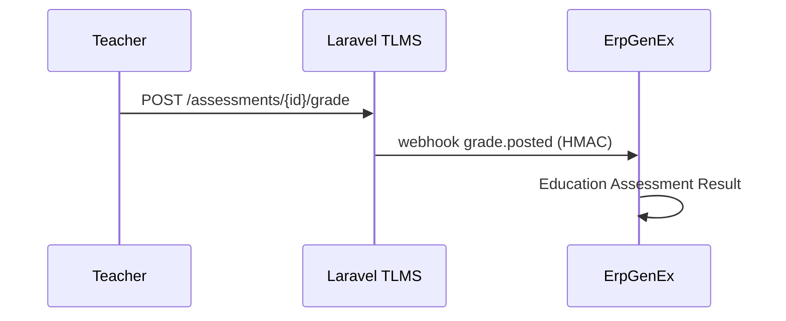

# Laravel TLMS Integration Prompt — Complete (ISMS §5)

> **Status:** ErpGenEx side **implemented** in `omnexa_education` · Laravel side **to build** using this prompt  
> **ErpGenEx desks:** `/app/education-laravel-integration` · `/app/education-finance-desk`  
> **Settings:** Education Settings → tab **Laravel TLMS Integration**

---

## 1. Architecture (implemented on ErpGenEx)

| System | Responsibility |
|--------|----------------|
| **ErpGenEx** (`omnexa_education`) | SIS, fees, admissions, **account lifecycle**, Frappe User, financial hold |
| **Laravel TLMS** | Timetables, lessons (live/recorded), e-assessments, teacher dossiers |

**Account states (ErpGenEx `Education Student.account_access_status`):**
`Not Provisioned` → `Provisioning` → `Active` ↔ `Financial Hold` / `Suspended` → `Withdrawn`

Finance triggers (implemented):
- Overdue `Sales Invoice` → auto `Financial Hold` + Laravel suspend
- `Payment Entry` submitted → release hold + Laravel resume
- Manual: Finance Desk / Student form buttons

---

## 2. ErpGenEx API surface (already live)

| Method | Path |
|--------|------|
| Ping | `omnexa_education.api.laravel_client.ping` |
| Provision | `omnexa_education.api.student_account_lifecycle.provision_student` |
| Suspend | `omnexa_education.api.student_account_lifecycle.suspend_student` |
| Resume | `omnexa_education.api.student_account_lifecycle.resume_student` |
| Bulk overdue | `omnexa_education.api.student_account_lifecycle.bulk_suspend_overdue` |
| LMS enroll sync | `omnexa_education.api.education_lms.sync_lms_enrollment` |
| Process queue | `omnexa_education.api.laravel_client.process_sync_queue` |
| **Webhook IN** | `POST /api/method/omnexa_education.api.laravel_webhooks.receive` |

**Webhook signature:** Header `X-ErpGenEx-Signature` = HMAC-SHA256(raw body, `laravel_webhook_secret`)

**DocTypes:**
- `Education Account Access Log` — audit trail
- `Education Laravel Sync Queue` — retry queue (hourly scheduler)
- `Education Lms Course Link` — provider `Laravel TLMS`

---

## 3. Prompt for AI / Laravel Developer

```
Build Laravel 11+ multi-tenant TLMS that integrates with ErpGenEx omnexa_education (ISMS §5).

### Stack
- Laravel 11, PHP 8.3+, PostgreSQL, Redis, Horizon
- Sanctum/Passport service tokens + JWT SSO (shared secret with ErpGenEx)
- Spatie Permission: admin, scheduler, teacher, student, parent
- OpenAPI 3.1 spec required

### Tenancy
- tenant_id = ErpGenEx `Education Institution` name (sent in header `X-ErpGenEx-School`)
- All queries scoped by tenant

### Inbound API (ErpGenEx → Laravel) — MUST implement

Base: `{laravel_base_url}/api/v1`

#### Health
GET /health
→ 200 {"status":"ok","message":"pong","version":"1.0"}

#### Users (ErpGenEx controls lifecycle — NEVER create students from Laravel UI)
POST /users/provision
POST /users/{laravel_user_id}/suspend
POST /users/{laravel_user_id}/resume
DELETE /users/{laravel_user_id}  (soft archive only)

Headers on every request:
  Authorization: Bearer {api_key from Education Settings}
  X-ErpGenEx-School: {institution_id}
  Content-Type: application/json

Provision payload (exact fields ErpGenEx sends):
{
  "external_id": "COMPANY-STU001",       // Education Student.name
  "student_code": "STU001",
  "email": "stu001@company.students.local",
  "first_name": "Ahmed",
  "last_name": "Hassan",
  "role": "student",
  "institution_id": "Al-Noor International",
  "grade_level": "Grade 11",
  "section": "11-A",
  "account_status": "active",
  "enrollments": [
    {"course_external_id": "MATH-G11", "section_external_id": "11-A", "role": "student"}
  ]
}

Response must include:
{"id": "uuid-or-int", "laravel_user_id": "same", "external_id": "...", "account_status": "active"}

Suspend payload:
{"reason": "Overdue fees", "account_status": "financial_hold"}

Suspend rules (CRITICAL):
- Invalidate all tokens/sessions immediately
- Block live lesson join + assessment submit
- If tenant config allow_readonly_on_hold=true → past recordings read-only only

Resume rules:
- Restore active status only — enrollments come from next POST /enrollments/sync

#### Rostering (OneRoster 1.2 aligned)
POST /classes/sync          — bulk upsert classes/courses
POST /enrollments/sync      — bulk upsert student↔class links
GET  /classes               — list for debugging

#### ISMS §5 — Teaching & Learning
POST   /timetables/draft
GET    /timetables/draft/{id}
POST   /timetables/draft/{id}/submit-for-approval
POST   /timetables/draft/{id}/approve
POST   /timetables/draft/{id}/reject
GET    /timetables/published/{term_id}

CRUD   /teachers/{id}/dossier
CRUD   /lessons               — type: live|recorded
POST   /lessons/{id}/start-live → {join_url, provider}
CRUD   /assessments
POST   /assessments/{id}/submit
POST   /assessments/{id}/grade

### Outbound Webhooks (Laravel → ErpGenEx)

URL: `{ERPGENEX_BASE_URL}/api/method/omnexa_education.api.laravel_webhooks.receive`
Header: X-ErpGenEx-Signature: sha256=<hmac_hex_of_raw_body>

Events (implement all):
1. grade.posted
2. timetable.approved
3. attendance.recorded
4. lesson.completed

Envelope:
{
  "event": "grade.posted",
  "timestamp": "2026-06-06T12:00:00Z",
  "school_id": "Al-Noor International",
  "data": { ... }
}

grade.posted data:
{
  "student_external_id": "COMPANY-STU001",
  "course_external_id": "MATH-G11",
  "assessment_external_id": "EXAM-MID-2026",
  "score": 87,
  "max_score": 100,
  "term": "2025-2026-T2"
}

timetable.approved data:
{
  "term_id": "2025-2026-T1",
  "periods": [
    {
      "section_external_id": "11-A",
      "subject_external_id": "MATH-G11",
      "teacher_external_id": "TCH-001",
      "day_of_week": "Sunday",
      "start_time": "08:00",
      "end_time": "08:45",
      "room_external_id": "R101"
    }
  ]
}

### SSO (optional but recommended)
- Shared JWT (`laravel_jwt_secret` in Education Settings)
- Claims: sub, email, role, student_code, external_id, financial_hold, account_status
- Reject JWT login when financial_hold=true OR account_status != active

### Database (minimum tables)
tenants, users, courses, classes, enrollments,
timetable_drafts, timetable_periods, timetable_approvals,
teacher_dossiers, lessons, assessments, assessment_submissions, grades,
webhook_logs, api_audit_logs

### Security
- 120 req/min per API key
- Encrypt email/phone at rest
- Audit: provision, suspend, resume, grade.posted
- IP allowlist per tenant (optional)

### Tests & deliverables
- PHPUnit: health, provision, suspend, resume, enrollment sync, each webhook
- Docker compose + seed: 1 school, 50 students, 10 teachers, 20 classes
- Postman collection + OpenAPI 3.1 YAML

### Out of scope (ErpGenEx handles)
- Fee plans, Sales Invoice, Payment Entry
- Admission waitlist, lottery, interviews
- Official transcripts / registrar approval workflow
- Parent subject-selection fee approval (Grades 10–12) — future ErpGenEx module
```

---

## 4. ErpGenEx configuration checklist

1. Open **Education Settings** → enable **Laravel TLMS**
2. Set **Laravel Base URL**, **API Key**, **Webhook Secret**
3. Enable **Auto suspend on overdue** + grace days
4. Click **Test Laravel Connection** (requires `GET /api/v1/health` on Laravel)
5. Open **Laravel TLMS Integration** desk → copy webhook URL to Laravel `.env`
6. Create **Education Lms Course Link** with provider **Laravel TLMS**
7. Map roles: `Education Student Portal`, `Education Parent Portal`, `Education Finance Officer`

```bash
# Ping test
bench --site {site} execute omnexa_education.api.laravel_client.ping

# Process sync queue manually
bench --site {site} execute omnexa_education.api.laravel_client.process_sync_queue

# Seed portal roles
bench --site {site} execute omnexa_education.api.education_role_demo.seed_education_roles
```

---

## 5. End-to-end acceptance tests

| # | Scenario | Pass criteria |
|---|----------|---------------|
| 1 | ErpGenEx provision student | Frappe User + Laravel user within 30s |
| 2 | Overdue invoice | `financial_hold=1`, User disabled, Laravel suspend |
| 3 | Payment Entry | Hold cleared, User enabled, Laravel resume |
| 4 | Manual suspend from Finance Desk | Access log + Laravel suspend |
| 5 | LMS enrollment sync | `Education Lms Course Link` → Laravel enrollment |
| 6 | grade.posted webhook | Row in `Education Assessment Result` |
| 7 | timetable.approved webhook | Rows in `Education Timetable Entry` |
| 8 | Invalid webhook signature | 401/403 from ErpGenEx |
| 9 | Student portal | Blocked message when financial hold |
| 10 | Queue retry | Failed sync → `Education Laravel Sync Queue` → success on retry |

---

## 6. Laravel `.env` template

```env
APP_NAME="School TLMS"
ERPGENEX_BASE_URL=https://erp.school.edu
ERPGENEX_WEBHOOK_URL=${ERPGENEX_BASE_URL}/api/method/omnexa_education.api.laravel_webhooks.receive
ERPGENEX_WEBHOOK_SECRET=whsec_...        # same as Education Settings
ERPGENEX_API_KEY=sk_live_...             # Laravel validates inbound ErpGenEx calls
ERPGENEX_TENANT_HEADER=X-ErpGenEx-School
JWT_SECRET=shared-with-erpgenex-sso      # same as laravel_jwt_secret
ALLOW_READONLY_ON_HOLD=false
```

---

## 7. Sequence diagrams

### Financial hold


### Grade sync


---

*ErpGenEx — Laravel TLMS Integration Prompt · v2.0 · ErpGenEx side complete*
